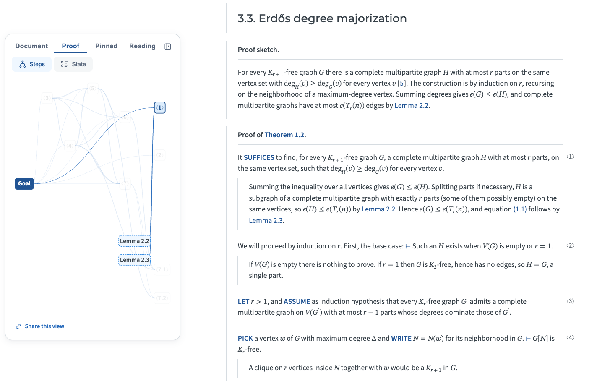

# Turán's theorem, from edges to eigenvalues

An interactive mathematics paper. Turán's theorem is presented through five
classical proofs and followed, via the variational argument of Motzkin and
Straus, upward into spectral graph theory. The mathematics is known; the
contribution is the *form* of its presentation: the reader chooses how the paper
is shown (fold to any depth, reorder a proof's steps into any logically valid
order, rebind notation, trace what each result rests on, share the exact view)
while the author's argument stays invariant.

This is a submission to the AMR [Paper of the Future
Prize](https://amathr.org/prizes/paper-of-the-future-prize/).



## What's here

- `main.rsm` — the paper's source.
- `main.css`, `widgets/` — the paper's own stylesheet and interactive widgets (the editable assets).
- `main.html`, `static/` — the built paper and the RSM runtime it loads. These are
  build artifacts (regenerated by `rsm build`), committed here as the frozen
  submission artifact so it can be read without building.

## Read it

The page loads JavaScript modules, so serve it over HTTP rather than opening
`file://`:

```sh
rsm serve                 # serves this directory; open the printed URL
# or: python -m http.server   → http://localhost:8000/main.html
```

## Build it yourself

The paper is written in [RSM](https://github.com/aris-pub/rsm) and builds with
one command. Pinned to the exact version used for this submission, so the build
is reproducible:

```sh
pip install rsm-lang==1.5.0          # or: uv pip install rsm-lang==1.5.0
rsm build main.rsm
```

This regenerates `main.html` (and the RSM runtime under `static/`) from
`main.rsm`, reproducing the paper. (The dependency-graph figures are laid out by
a third-party library, so their SVG coordinates can shift slightly between
dependency versions; the content is identical.)

## About

Written in **RSM** (Readable Science Markup), the open-source semantic markup
language from [The Aris Program](https://github.com/aris-pub). Every reader
control above is a feature of RSM, not of this document: any RSM paper gets them
for free.

## License

MIT. See [LICENSE](LICENSE). The bundled RSM runtime under `static/` is part of
[rsm-lang](https://github.com/aris-pub/rsm) and carries its own license.
